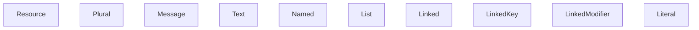

# High-level architecture

## Intlify Message Syntax

The Message Syntax specification used in Vue I18n is defined [here](./spec/syntax.ebnf).

## Intlify Message Syntax AST

```mermaid
flowchart TD
  Resource
  Plural
  Message
  Text
  Named
  List
  Linked
  LinkedKey
  LinkedModifier
  Literal
```
